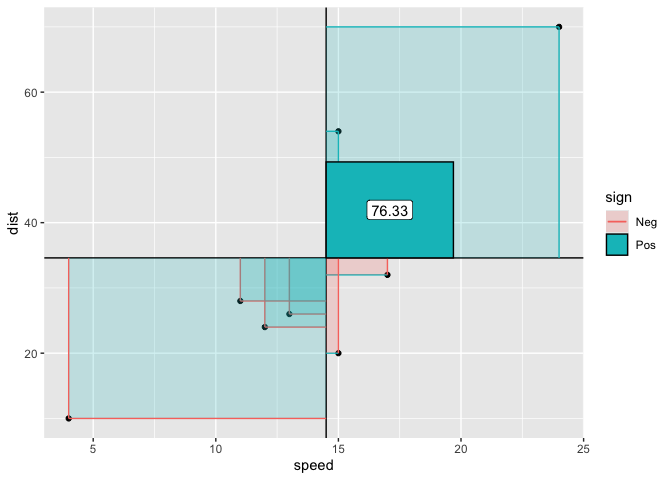
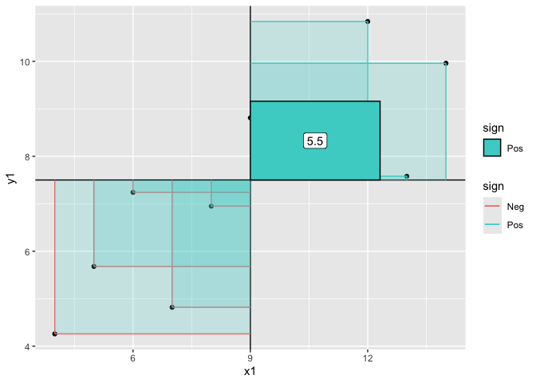
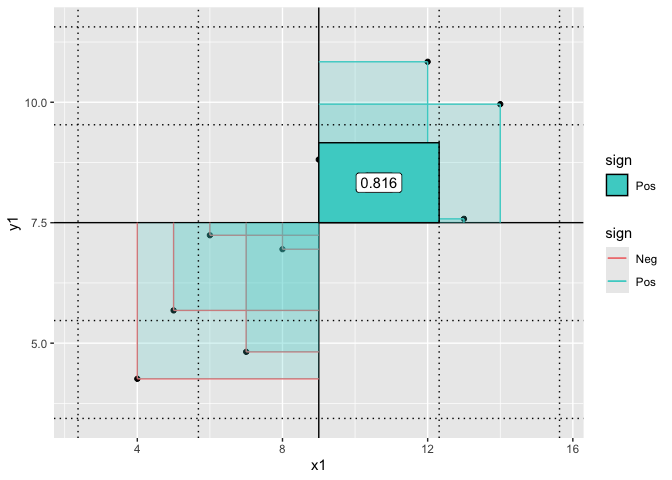
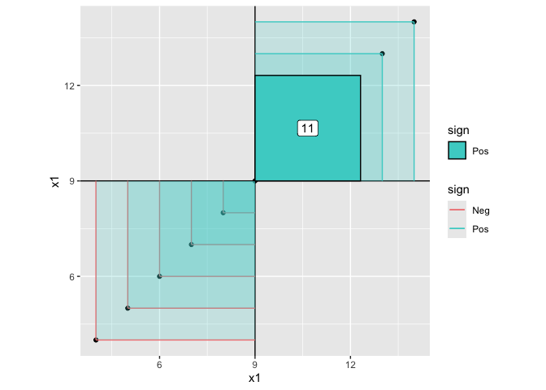
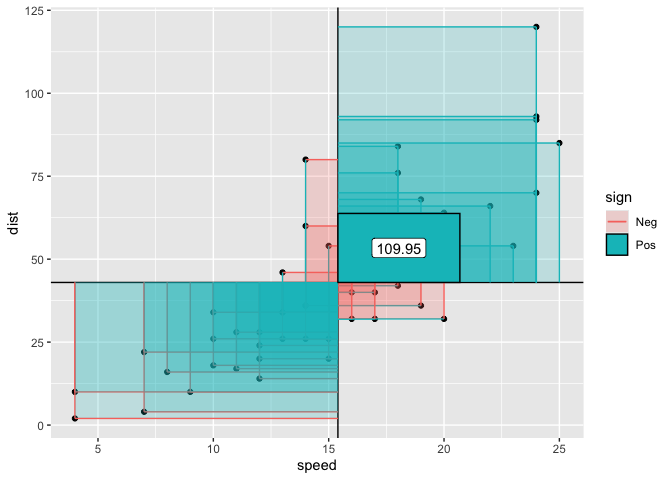
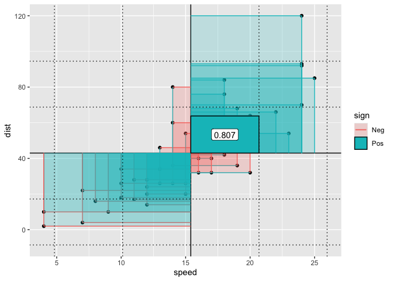
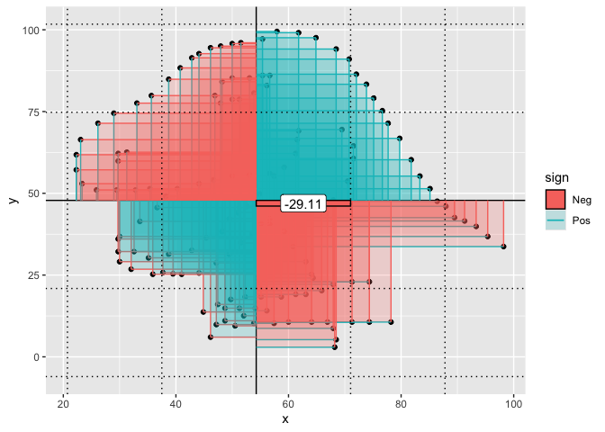
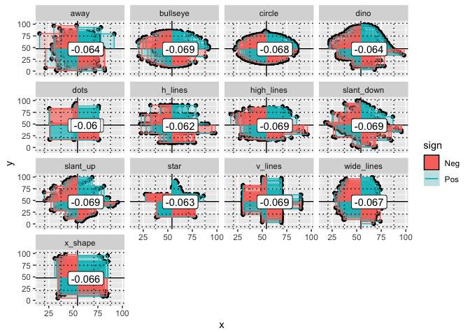
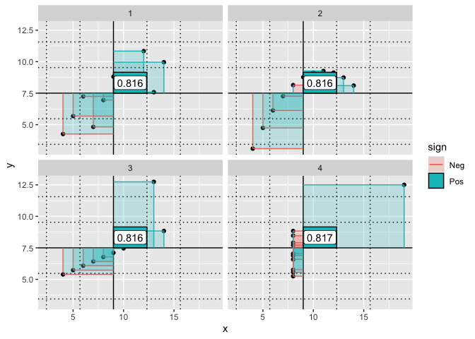

<!-- README.md is generated from README.Rmd. Please edit that file -->

# ggcorrelate

<!-- badges: start -->

[](https://lifecycle.r-lib.org/articles/stages.html#experimental)
<!-- badges: end -->

The goal of ggcorrelate is to …

1.  provide convenience layers for visually exploring covariance,
    variance, standard deviation and pearson correlation
2.  Explore new ways of writing convenience layers with ggplot2
    extension shorthand used - ‘express’ methodologies
3.  Document this exploration and retain the narrative by including all
    the code in the readme, to allow for discussion, vetting, ease for
    contribution, and in the future, if deemed sound, provide how-to
    reference for other ggplot2 stats extenders in stats education.
    Check out [source](./README.Rmd)

Only interested in the proposed convenience layers? Jump to [layers
usage examples](#layers-usage) or the [traditional
readme](#traditional-readme)

### Step 00. Create this readme

``` r
# eval set to false for this chunk
usethis::use_readme_rmd()
```

### Step 0. Create a package space with

``` r
# eval set to false for this chunk
devtools::create(".")
usethis::use_lifecycle_badge("experimental")
```

### some express extension stuff

Sometimes, you may be looking for a shortcut to writing ggplot2
extension layers. This might enable you to think more about the
computation you want to deliver and less about naming things. The
approach we’ll use is the {statexpress} approach (also notable is
stat_manual in base ggplot2 which allows group-wise computation). Once
you’ve figured out the compute that’s necessary, you might circle back
and classically create a stat.

Instead of importing {statexpress}, we’ll just copy the functionality
over here and you can have a look at it’s construction. {statexpress} is
in a feedback welcome phase, so exposing some code here.

Skip to the next section if you are more interested in the correlation
exploration layers!

``` r
# grabs code from 'expresshelpers' chunk below
knitrExtra:::chunk_to_r("expresshelpers")
#> It seems you are currently knitting a Rmd/Qmd file. The parsing of the file will be done in a new R session.
```

``` r
# Some functionality that is being tried out in {statexpress}


###############################################
# qstat - an express method for creating Stats locally
######################################
qstat <- function(compute_group, ...){
  ggproto("StatTemp", Stat, compute_group = compute_group, ...)
  }

################################
# qlayer - a version of layer with more defaults
###########################
qlayer <- function (mapping = NULL, data = NULL, geom = "point", stat = "identity", position = "identity", 
    ..., na.rm = FALSE, show.legend = NA, inherit.aes = TRUE) 
{
    layer(data = data, mapping = mapping, stat = stat, geom = geom, 
        position = position, show.legend = show.legend, inherit.aes = inherit.aes, 
        params = rlang::list2(na.rm = na.rm, ...))
}

################################
# proto_update - update default_aes quickly, based on existing defaults
###########################
proto_update <- function(`_class`, `_inherit`, default_aes_update = NULL, ...){
  
  if(!is.null(default_aes_update)){
  
    default_aes <- aes(!!!modifyList(`_inherit`$default_aes, default_aes_update))
    
    }
  
  ggplot2::ggproto(`_class` = `_class`, 
          `_inherit` = `_inherit`, 
          default_aes = default_aes, ...)
  
}

################################
# qproto_update - update, defaults for ggplot2 object, and use locally
###########################
qproto_update <- function(`_inherit`, default_aes_update = NULL, ...){
  
  proto_update("protoTemp", 
               `_inherit`, 
               default_aes_update = default_aes_update,
               ...)
}
```

## write some layers

Using qstat and qlayer and friends, we write some convenience layers
that will help us visualize how we arrive at the covarience,
correlation, etc.

``` r
knitrExtra:::chunk_to_r("layers")
#> It seems you are currently knitting a Rmd/Qmd file. The parsing of the file will be done in a new R session.
```

``` r
######################################
# Layer 0 (actually don't use in the statistical exploration, but it's a very simple case, so here for educational purposes)

compute_group_xymean <- function(data, scales){
  
  data |> mutate(x = mean(x), y = mean(y))
  
  }

#' @export
geom_xy_means <- function(...){
  
  geom_point(stat = qstat(compute_group_xymean), ...)
  
  }

######################################
# Layer 1, geom_xmean
compute_group_xmean <- function(data, scales){
  data |> dplyr::summarize(xintercept = mean(x))
  }

#' @export
geom_xmean <- function(...){
  
  QStat <- qstat(compute_group_xmean, dropped_aes = c("x", "y"))
  
  qlayer(geom = GeomVline, stat = QStat, ...)
  
  
  }

######################################
# Layer 2, geom_ymean

compute_group_ymean <- function(data, scales){data |> summarize(yintercept = mean(y))}

#' @export
geom_ymean <- function(...){
  
  QStat <- qstat(compute_group_ymean, dropped_aes = c("x", "y"))
  
  qlayer(geom = GeomHline, stat = QStat, ...)
  
  }

######################################
# Layer 3, geom_xmeandiff
compute_group_xmeandiff <- function(data, scales){
  
  sign_levels <- c("Neg", "Pos")
  
  data |> mutate(xend = mean(x), 
                 yend = y, 
                 xdiff = x - mean(x), 
                 sign = ifelse(xdiff < 0, "Neg", "Pos"),
                 sign = factor(sign, sign_levels)
  )
  
  }

#' @export
geom_xmeandiff <- function(...){
  
  
  QStat <- qstat(compute_group_xmeandiff, 
                 default_aes = aes(color = after_stat(sign)))
  
  geom_segment(stat = QStat, ...)
  
  }

######################################
# Layer, geom_ymeandiff
compute_group_ymeandiff <- function(data, scales){
  
  sign_levels <- c("Neg", "Pos")

  data |> mutate(yend = mean(y), 
                 xend = x, 
                 ydiff = y - mean(y), 
                 sign = ifelse(ydiff < 0, "Neg", "Pos"),
                 sign = factor(sign, sign_levels))
  }

#' @export
geom_ymeandiff <- function(...){
  
  QStat <- qstat(compute_group_ymeandiff, 
              default_aes = aes(color = after_stat(sign)))
  
  geom_segment(stat = QStat, ...)
  
  }

######################################
# Layer, geom_xydiffs
compute_group_xymeandiffs <- function(data, scales){
  
  sign_levels <- c("Neg", "Pos")

  data |> dplyr::mutate(xmin = mean(x), ymin = mean(y), 
                 xmax = x, ymax = y, 
                 area = (xmax-xmin)*(ymax-ymin), 
                 sign = ifelse(area < 0, "Neg", "Pos"),
                 sign = factor(sign, sign_levels))
  }

#' @export
geom_xydiffs <- function(alpha = .2, ...){
  
  QS <- qstat(compute_group_xymeandiffs, 
               default_aes = aes(fill = after_stat(sign)))
  QG <- qproto_update(GeomRect, aes(alpha = .2))
  
  qlayer(stat = QS, geom = QG, ...)
  
  }


######################################
# Layer 6 & 7 geom_covariance & geom_covariance_label
compute_covariance <- function(data, scales){
   
  sign_levels <- c("Neg", "Pos")
  
  xmean = mean(data$x)
  ymean = mean(data$y)
  xsd = sd(data$x)
  ysd = sd(data$y)
  
  data |> 
    dplyr::mutate(xdiff = x - mean(x),                                
           ydiff = y - mean(y),   
           area = xdiff * ydiff) |>
    dplyr::summarize(mean_area = sum(area)/(n()-1)) |>
    dplyr::pull(mean_area) ->
  mean_area
  
  sign_levels <- c("Neg", "Pos")
  
  data.frame(xmin = xmean, ymin = ymean,
             xmax = xmean + xsd, ymax = ymean + mean_area/xsd,
             covariance = mean_area,
             correlation = mean_area/(xsd*ysd)) %>% 
    mutate(sign = ifelse(mean_area < 0, "Neg", "Pos"),
           sign = factor(sign, sign_levels)) |>
    mutate(x = (xmin + xmax)/2,
           y = (ymin + ymax)/2)
  
}
  
#' @export
geom_covariance <- function(...){
  
  QS <- qstat(compute_covariance,
                 default_aes = aes(fill = after_stat(sign)))
  
  QG <- qproto_update(GeomRect, aes(color = "black"))
  
  qlayer(stat = QS, geom = QG, ...)
  
}  


#' @export
geom_mean_xdiffXydiff <- geom_covariance

#' @export
geom_covariance_label <- function(...){
  
  QS <- qstat(compute_covariance,
                 default_aes = 
                   aes(label = round(after_stat(covariance), 2))
                 )
                                   
  geom_label(stat = QS,
             show.legend = F,
                         ...)
  
}

#' @export
geom_correlation_label <- function(...){
  
  QS <- qstat(compute_covariance,
                 default_aes = 
                   aes(label = round(after_stat(correlation), 3))
                 )
                                   
  geom_label(stat = QS,
             show.legend = F,
                         ...)
  
}
  

######################################
# Layer geom_x_sd
compute_sdx <- function(data, scales){
  
  ymean <- mean(data$y)
  xmean <- mean(data$x)
  xsd <- sd(data$x)
  
  data.frame(xintercept = xmean + xsd*c(-2,-1,1,2)) |>
    dplyr::mutate(xstart = xmean,
            ystart = ymean,
            xend = xstart + xsd,
            yend = ystart)

    }

#' @export
geom_x_sd <- function(...){
  
  QS <- qstat(compute_sdx, dropped_aes = c("x", "y"))
  QG <- qproto_update(GeomVline, aes(linetype = "dotted"))
  
  qlayer(geom = QG, stat = QS, ...)
  
}

######################################
# Layer geom_y_sd
compute_sdy <- function(data, scales){
  
  ymean <- mean(data$y)
  ysd <- sd(data$y)
  
  data.frame(yintercept = ymean + ysd*c(-2,-1,1,2))

    }

#' @export
geom_y_sd <- function(...){
  
  QS <- qstat(compute_sdy, 
              dropped_aes = c("x", "y"))
  
  # GeomHline$default_aes
  QG <- qproto_update(GeomHline, aes(linetype = "dotted"))

  qlayer(geom = QG, stat = QS, ...)
  
}
```

``` r
scale_color_corr <- function(...){scale_color_manual(values = c("lightcoral","mediumturquoise"), breaks = c("Neg", "Pos"), ...)}
scale_fill_corr <- function(...){scale_fill_manual(values = c("lightcoral","mediumturquoise"), breaks = c("Neg", "Pos"), ...)}

scale_color_fill_corr <- function(){
  
  list(
    scale_fill_corr(),
    scale_color_corr()
  )
  
  
}
```

## layers usage

``` r
set.seed(12345)
cars |>
  sample_n(10) |>
  ggplot() + 
  aes(x = speed, y = dist) +
  geom_point() + # x, y  0
  geom_xmean() + # x-bar 1
  geom_ymean() + # y-bar 2
  geom_xmeandiff() + # 3
  geom_ymeandiff() + # 4
  geom_xydiffs() + # 5
  geom_covariance() + #6
  geom_covariance_label() 
```

<!-- -->

``` r


last_plot() + #7
  geom_x_sd() + 
  geom_y_sd() + 
  geom_correlation_label()
```

<!-- -->

``` r


anscombe |>
  ggplot() + 
  aes(x = x1, y = y1) +
  geom_point() + # x, y  0
  geom_xmean() + # x-bar 1
  geom_ymean() + # y-bar 2
  geom_xmeandiff() + # 3
  geom_ymeandiff() + # 4
  geom_xydiffs() + # 5
  geom_covariance() + #6
  geom_covariance_label() + #7
  scale_fill_corr() + 
  scale_color_corr()
```

<!-- -->

``` r

last_plot() + 
  geom_x_sd() + 
  geom_y_sd() + 
  geom_correlation_label()
```

<!-- -->

``` r

# variance and sd
anscombe |>
  ggplot() + 
  aes(x = x1, y = x1) +
  coord_equal() +
  geom_point() + # x, y  0
  geom_xmean() + # x-bar 1
  geom_ymean() + # y-bar 2
  geom_xmeandiff() + # 3
  geom_ymeandiff() + # 4
  geom_xydiffs() + # 5
  geom_covariance() + # i.e. variance
  geom_covariance_label() +
  scale_color_fill_corr()
```

<!-- -->

``` r
knitrExtra:::chunk_to_r("layers_wrap")
#> It seems you are currently knitting a Rmd/Qmd file. The parsing of the file will be done in a new R session.
```

``` r
#' @export
layers_covariance <- function(){
  
  list(
  geom_point(),
  geom_xmean(),
  geom_ymean(),
  geom_xmeandiff(),
  geom_ymeandiff(),
  geom_xydiffs(),
  geom_covariance(),
  geom_covariance_label())
  
}

#' @export
layers_correlation <- function(){
  
  list(
  geom_point(),
  geom_xmean(),
  geom_ymean(),
  geom_xmeandiff(),
  geom_ymeandiff(),
  geom_xydiffs(),
  geom_x_sd(),
  geom_y_sd(),
  geom_covariance(),
  geom_correlation_label())
  
}
```

``` r
cars |>
  ggplot() + 
  aes(x = speed, y = dist) + 
  layers_covariance()
```

<!-- -->

``` r

cars |>
  ggplot() + 
  aes(x = speed, y = dist) + 
  layers_correlation()
```

<!-- -->

# Minimal viable package

``` r
usethis::use_package("ggplot2")
usethis::use_package("dplyr")
devtools::check(".")
devtools::install(pkg = ".", upgrade = "never") 
```

# Traditional readme

``` r
rm(list = ls())
library(ggcorrelate)
library(tidyverse)
library(datasauRus)

datasaurus_dozen |> 
  filter(dataset == "dino") |> 
  ggplot() + 
  aes(x = x, y = y) + 
  geom_point() + # x, y  0
  geom_xmean() + # x-bar 1
  geom_ymean() + # y-bar 2
  geom_xmeandiff() + # 3
  geom_ymeandiff() + # 4
  geom_xydiffs() + # 5
  geom_covariance() + #6
  geom_covariance_label() + #7
  geom_x_sd() + 
  geom_y_sd() 
```

<!-- -->

``` r
head(datasaurus_dozen)
#> # A tibble: 6 × 3
#>   dataset     x     y
#>   <chr>   <dbl> <dbl>
#> 1 dino     55.4  97.2
#> 2 dino     51.5  96.0
#> 3 dino     46.2  94.5
#> 4 dino     42.8  91.4
#> 5 dino     40.8  88.3
#> 6 dino     38.7  84.9
```

``` r

datasaurus_dozen |>
  ggplot() + 
  aes(x, y) + 
  geom_point() + 
  facet_wrap(facet = vars(dataset)) + 
  layers_covariance()
```

<!-- -->

``` r

last_plot() + 
  geom_x_sd() + geom_y_sd() +
  geom_correlation_label()
```

<!-- -->

``` r

anscombe |> 
  pivot_longer(everything(), 
    names_to = c(".value", "dataset"), 
    names_pattern = "(.)(.)"
  ) %>% 
  arrange(dataset) ->
anscombe_long

head(anscombe_long)
#> # A tibble: 6 × 3
#>   dataset     x     y
#>   <chr>   <dbl> <dbl>
#> 1 1          10  8.04
#> 2 1           8  6.95
#> 3 1          13  7.58
#> 4 1           9  8.81
#> 5 1          11  8.33
#> 6 1          14  9.96
```

``` r

anscombe_long |>
  ggplot() + 
  aes(x, y) + 
  facet_wrap(facet = vars(dataset)) +
  layers_correlation() 
```

<!-- -->
